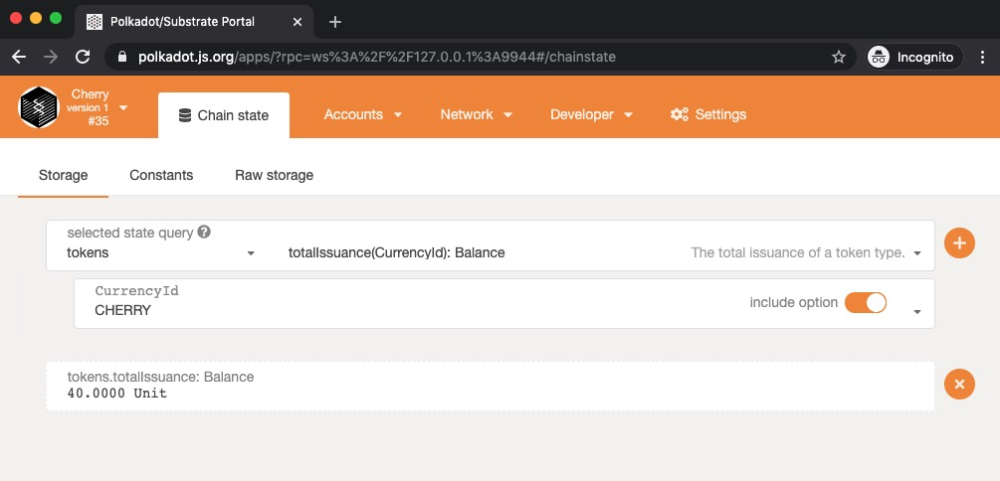

# Enable Multi-Currency Support

### Hackathon: Hello World! by Polkadot

##### [[ECOSYSTEM CHALLENGE] Enable Multi-Currency Support](https://gitcoin.co/issue/AcalaNetwork/polakdot-hello-world-acala/2/100023952)

#### substrate-node-template
- Added orml-tokens pallet to runtime.
- Minted my custom token - CHERRY
- Added types to polkadotJS.

#### Screens

---

:star2: start it if you like this!!
:raising_hand: By [CherryLiang](https://github.com/CaiYiLiang)