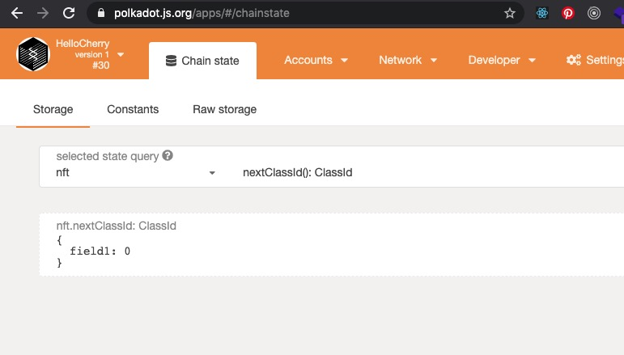
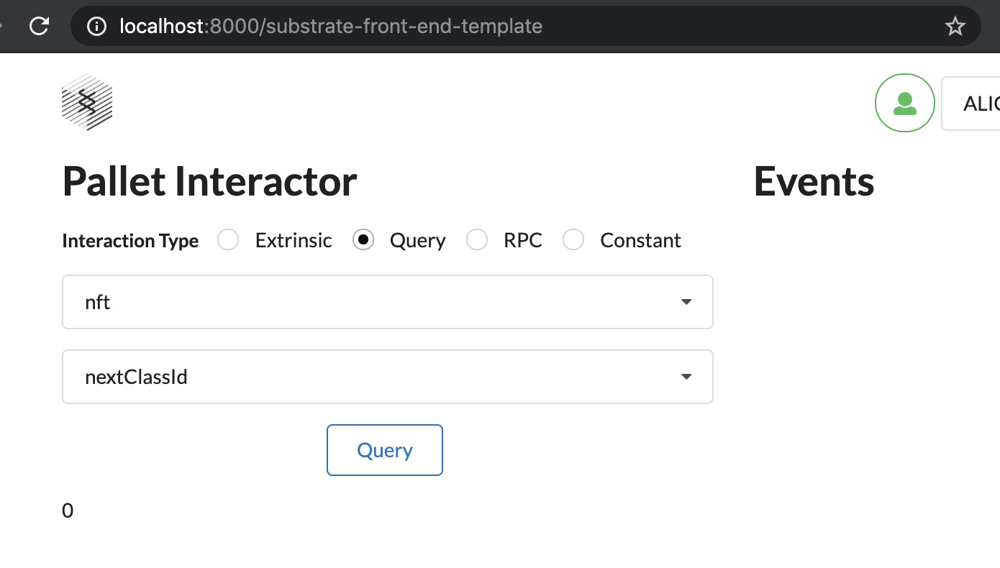

# Enable NFT Support

### Hackathon: Hello World! by Polkadot

##### [[ECOSYSTEM CHALLENGE] Enable NFT Support](https://gitcoin.co/issue/AcalaNetwork/polakdot-hello-world-acala/1/100023951)

#### substrate-node-template
- Add [orml-nft](https://github.com/open-web3-stack/open-runtime-module-library/tree/master/nft) pallet

#### Screens

---

:star2: start it if you like this!!
:raising_hand: By [CherryLiang](https://github.com/CaiYiLiang)