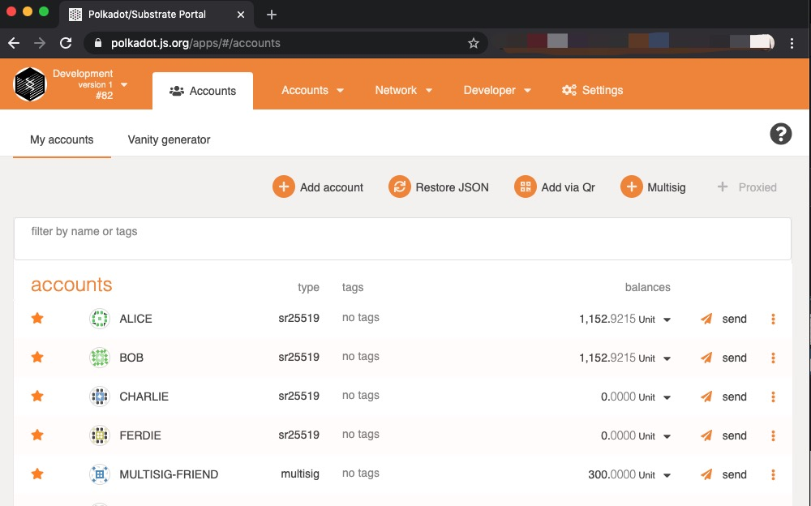
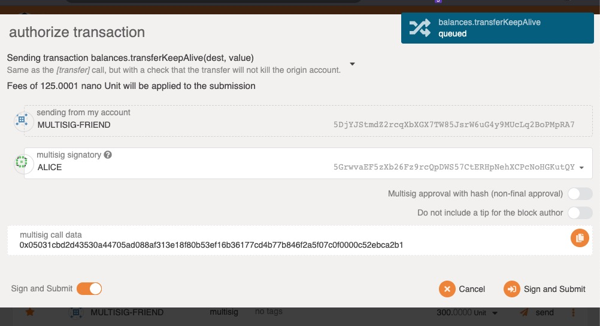
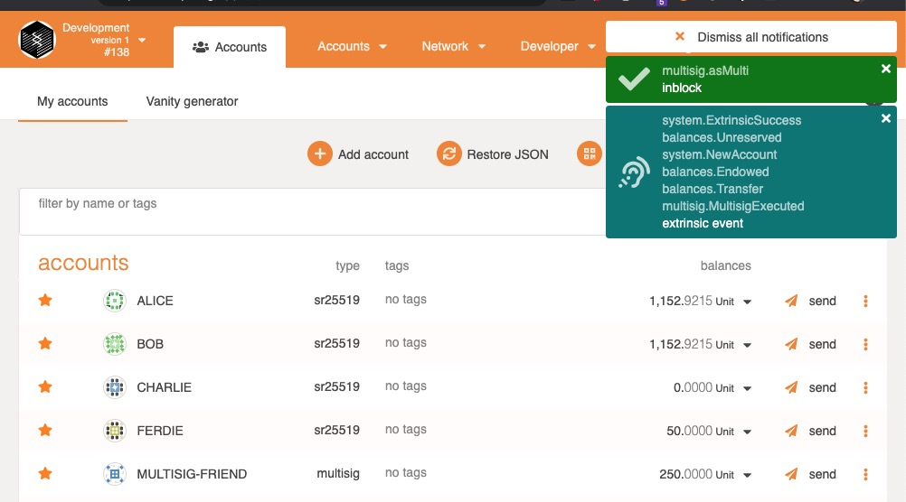
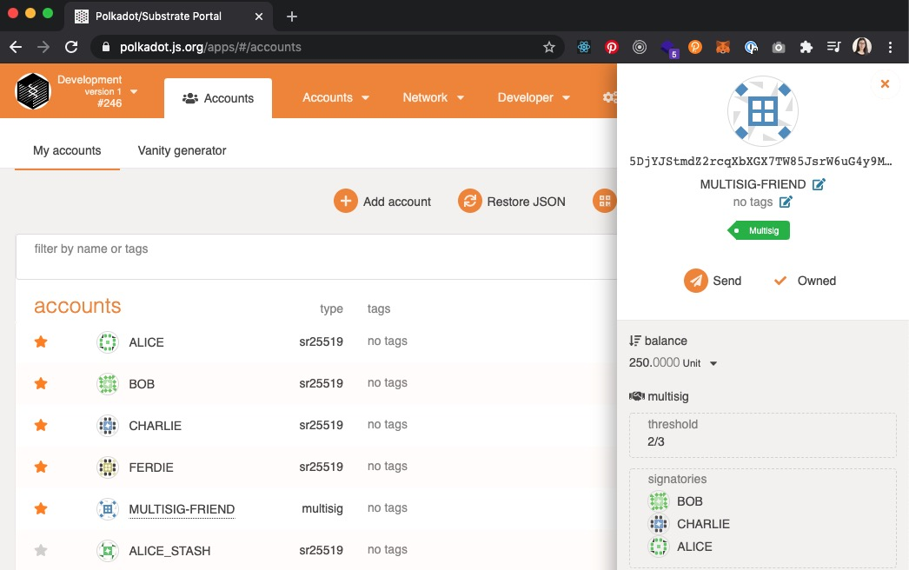
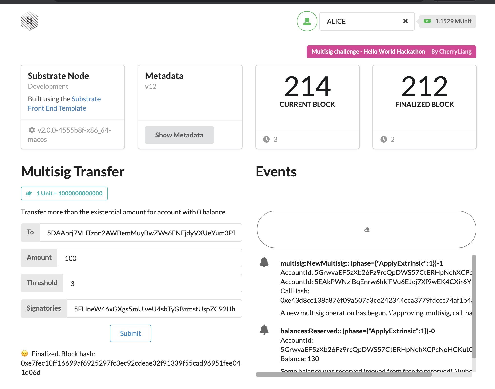
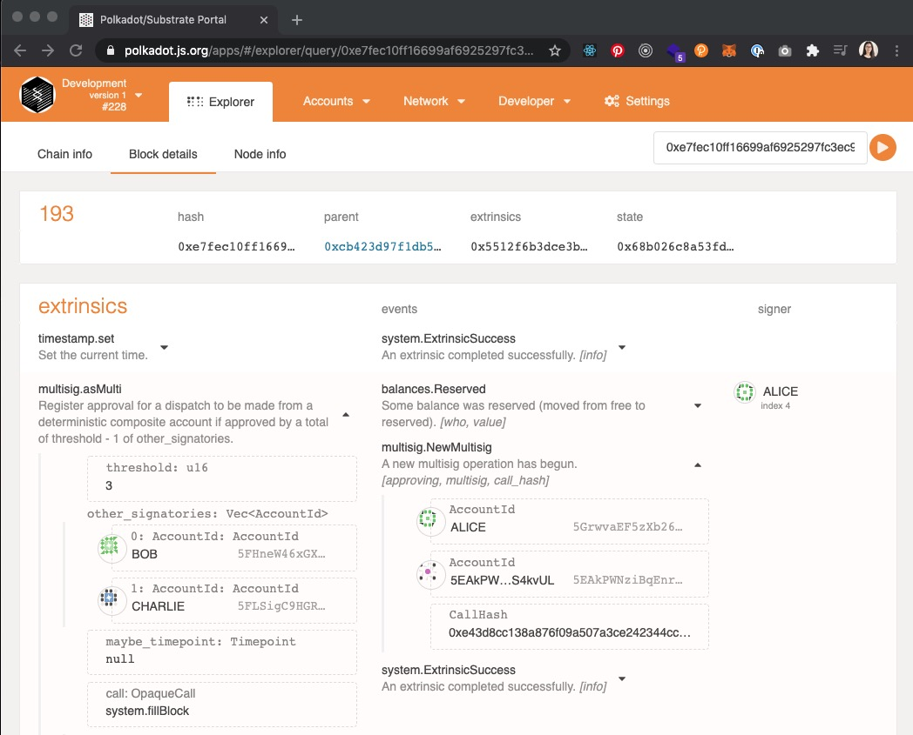

# FRAME Multisig

### Hackathon: Hello World! by Polkadot

##### [[INTERMEDIATE CHALLENGE] FRAME Multisig](https://gitcoin.co/issue/Polkadot-Network/hello-world-by-polkadot/8/100023934)

#### Screens
##### Polkadot-JS 

made a multisig transaction from multisig account to FRIEND with 50 amount

---
##### Front-End Template
  
A multisig UI component

---

:star2: start it if you like this!!
:raising_hand: By [CherryLiang](https://github.com/CaiYiLiang)